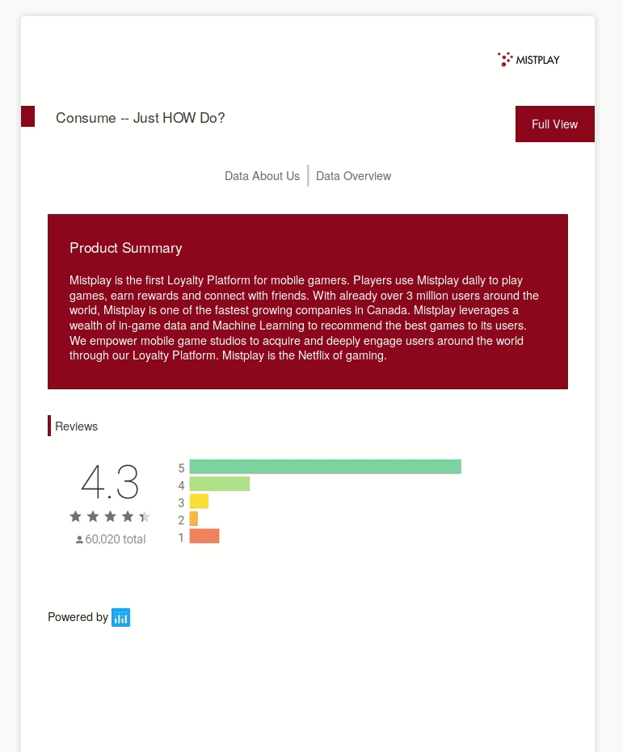
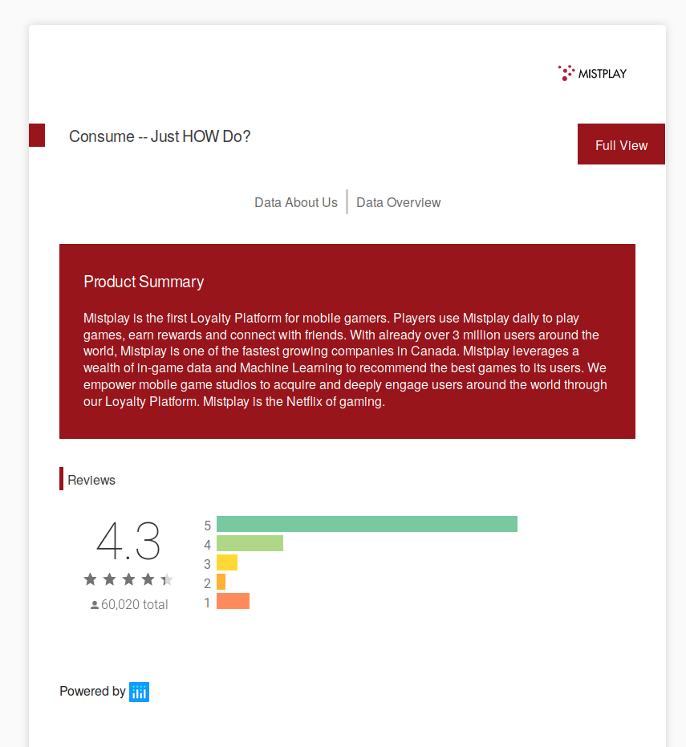
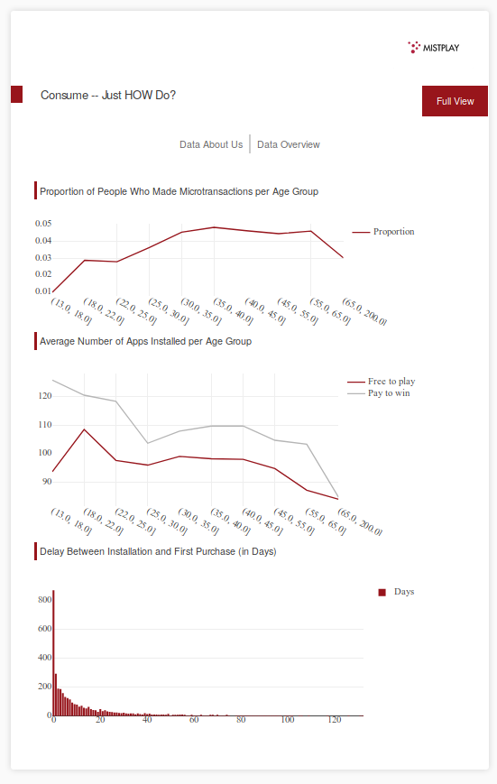
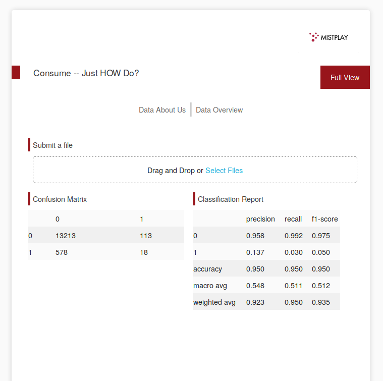

# Consume -- Just HOW Do?

Front end template taken from [Dash apps](https://github.com/plotly/dash-sample-apps/tree/master/apps/dash-financial-report) for [code.jam(2019)](https://devpost.com/software/consume-just-how-do), see link for a more detailed explanation of the project.

# Project difficulties and attempted solutions

## Data Imbalance
We observed early on an issue with the data we were given: less than 5% of the data provided could be used a target. 	

## Built With

- [Dash](https://dash.plot.ly/) - Main server and interactive components
- [Plotly Python](https://plot.ly/python/) - Used to create the interactive plots

The following are screenshots for the app in this repo:

